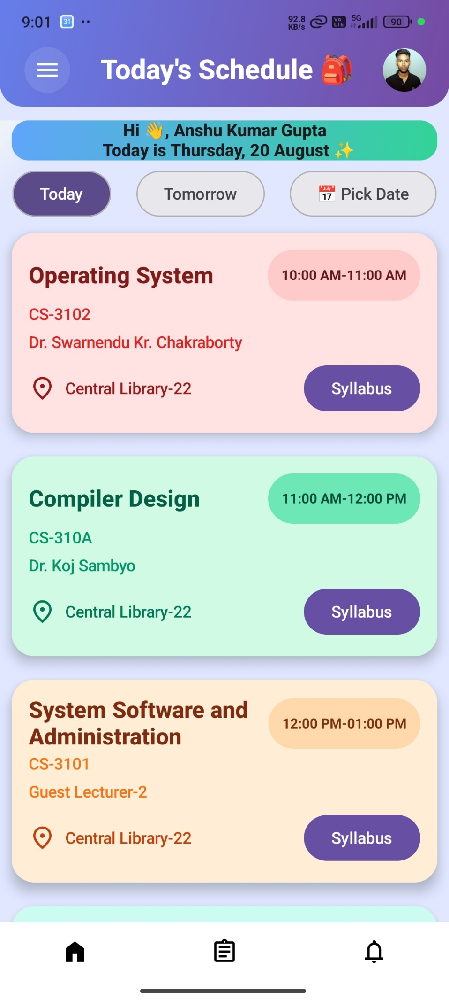
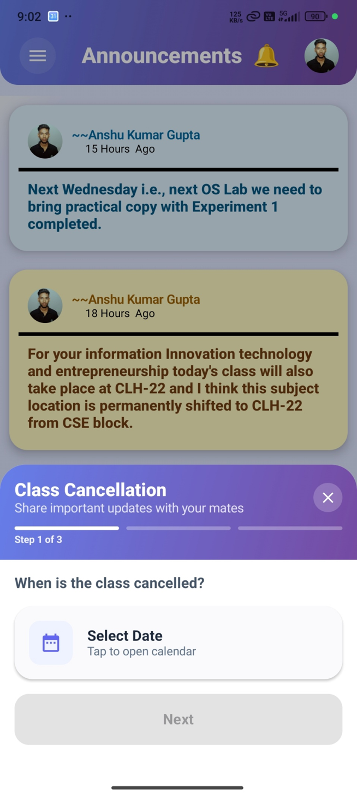
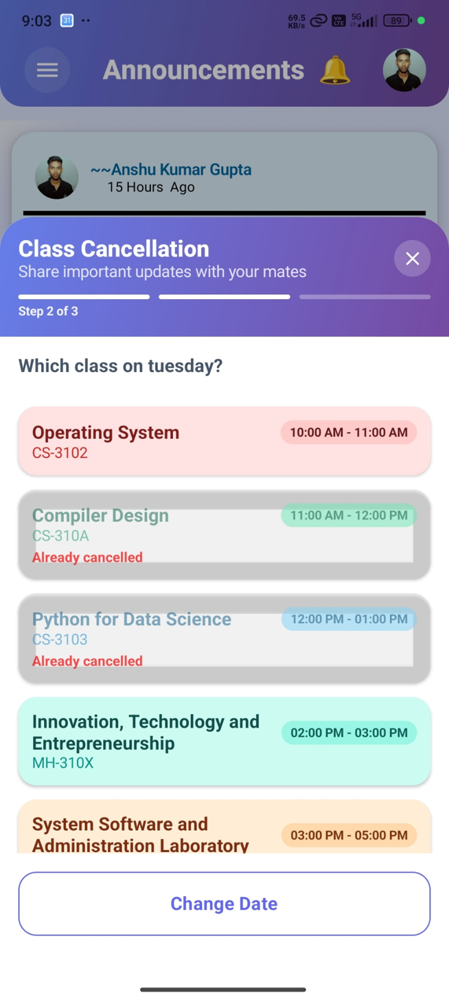
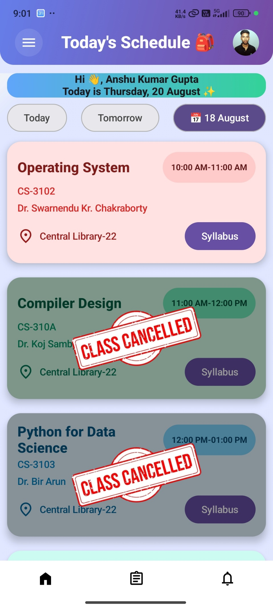
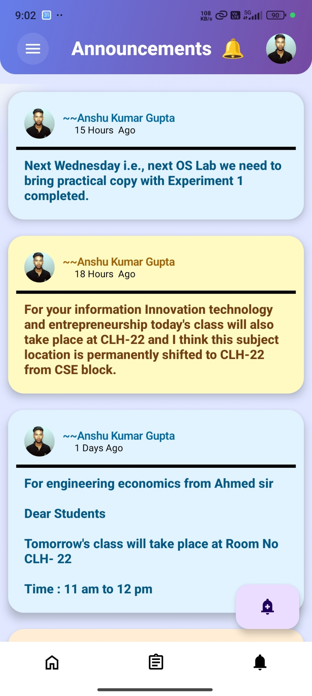
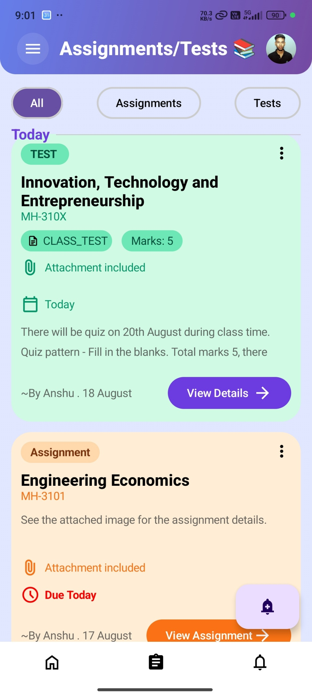
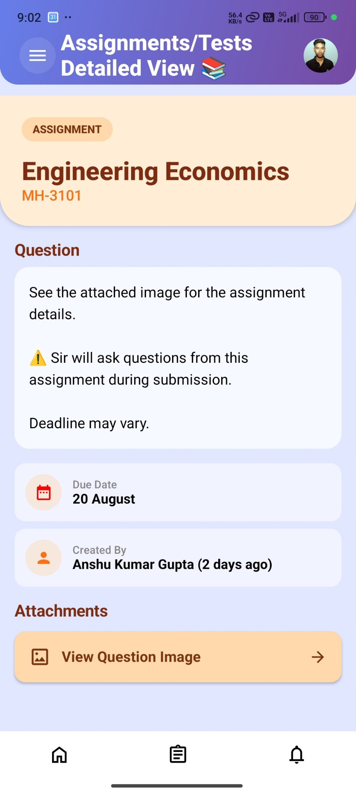
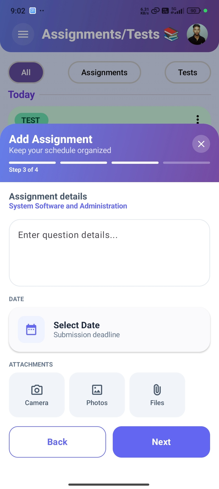

# College Mate 📚

> A real-world Android MVP for centralizing class schedules, academic announcements, assignments, tests, and class-cancellation updates in one place.

**College Mate is currently deployed as a pilot to 29 students from the NIT Arunachal Pradesh CSE 2024 batch.**

> 🔐 **Access:** The application is currently restricted to the pilot batch through institute-email authentication, so the app cannot be directly accessed by external reviewers.

## 🎥 Demo

A complete walkthrough of the application is available here:

**[▶️ Watch the College Mate Demo](https://drive.google.com/file/d/12U8tDhUYs-oq-oTYt1x968MQJVcvYTxD/view?usp=sharing)**

The video demonstrates the main student workflows, including the daily schedule, announcements, assignments/tests, and class-cancellation flow.

---

## 📱 Screenshots

### Today's Schedule

Students can view the schedule for **Today, Tomorrow, or a selected date**, including subject, time, faculty, classroom, and syllabus access.

### Real-Time Class Cancellation

The class-cancellation workflow lets an authorized user select the date and affected class.

Once a cancellation is published, the affected class is reflected directly in the schedule.

### Centralized Announcements

Important academic updates such as room changes, practical instructions, and other batch-wide information are available in one feed.

### Assignments & Tests

Assignments and tests are organized in a unified academic dashboard with deadlines, test information, attachments, and details.

### Assignment Details

Students can open an assignment to view its question/details, deadline, creator, and attached resources.

### Adding an Assignment

Authorized users can create assignments by entering the details, selecting a deadline, and attaching files or images.

---

## 🎯 Problem

At our college, important academic information was commonly distributed through WhatsApp groups and PDF schedules. This created several practical problems:

- Class cancellations and schedule changes could get buried in group messages.
- Students had to repeatedly check WhatsApp for important updates.
- Assignments and tests were scattered across conversations.
- Students had to open PDF schedules repeatedly to check their daily routine.
- Academic information was not centralized or consistently organized.

A survey of 30 students was conducted during the initial problem-identification stage. The results indicated strong interest in a dedicated academic application.

---

## 💡 Solution

College Mate provides a centralized academic dashboard where students can:

- Check their daily class schedule without opening PDFs.
- View upcoming classes for tomorrow or another selected date.
- Receive class-cancellation updates.
- Read centralized academic announcements.
- Track assignments and tests with deadlines and details.
- Access attached academic resources.
- Receive push notifications for important updates.

---

## ✨ Key Features

### 📅 Real-Time Daily Routine
- Today's, Tomorrow's, and selected-date schedule views.
- Subject, faculty, time, classroom, and syllabus information.
- Schedule changes are reflected from the backend in real time.

### 🚨 Class Cancellation Alerts
- Authorized users can publish a class cancellation.
- The affected class is marked as cancelled in the schedule.
- Students receive push notifications through Firebase Cloud Messaging.
- Cancellation announcements are retained in the announcement history.

### 📢 Centralized Announcements
- General academic announcements in one feed.
- Dedicated class-cancellation announcements.
- Persistent announcement history synchronized with Firestore.

### 📝 Assignments & Tests
- Unified dashboard for assignments and tests.
- Deadlines and test information.
- Assignment details and attachments.
- Support for academic resources through attached files or links.

### 🎓 Elective-Based Routine Personalization
The application resolves Open Elective schedules so that students can see the routine relevant to their elective combination.

### 🎂 Birthday Alerts
Birthday information is used to generate scheduled local notifications through WorkManager.

### 🔔 Push Notifications
Firebase Cloud Messaging (FCM) is used to deliver important announcements and cancellation alerts even when the application is not open.

---

## 🏗️ Architecture

College Mate follows an **MVVM (Model–View–ViewModel)** architecture.

- **Model / Data Layer:** Firebase-backed repositories and application data models.
- **ViewModel:** Manages UI state and coordinates data with Compose screens.
- **View:** Jetpack Compose screens and reusable UI components.
- **Repository Pattern:** Keeps Firebase data access separate from UI logic.
- **Reactive State:** Kotlin `Flow` / `StateFlow` is used for observable application state.
- **Navigation:** Jetpack Compose Navigation manages application routes.
- **Background Work:** WorkManager is used for scheduled local tasks such as birthday notifications.
- **Dependency Management:** The current implementation uses manual dependency injection through repository / Firebase instances rather than a full Hilt-based Clean Architecture setup.

---

## 🔥 Firebase & Real-Time Data

The application uses Firebase as its backend infrastructure:

| Service | Purpose |
|---|---|
| **Firebase Authentication** | Google-based sign-in and institute-email access restriction |
| **Cloud Firestore** | Stores academic data and provides real-time updates |
| **Firebase Cloud Messaging (FCM)** | Push notifications for important updates |
| **Firebase Storage** | Stores/serves selected academic resources and profile media |

Firestore snapshot listeners are integrated with Kotlin `Flow` / `callbackFlow`, allowing relevant screens to react to backend changes without requiring a manual refresh.

---

## 🛠️ Tech Stack

**Language**
- Kotlin

**UI**
- Jetpack Compose
- Material 3
- Coil

**Architecture & Android**
- MVVM
- ViewModel
- Kotlin Coroutines
- Flow / StateFlow
- Jetpack Compose Navigation
- WorkManager

**Backend**
- Firebase Authentication
- Cloud Firestore
- Firebase Cloud Messaging
- Firebase Storage

**Development**
- Git
- GitHub
- Android Studio

---

## 🚀 Deployment & Current Status

**Status:** 🟢 Working pilot / deployed MVP

- **Current users:** 29 students
- **Pilot group:** NIT Arunachal Pradesh CSE 2024 batch
- **Authentication:** Restricted to the institute-email-based pilot group
- **Distribution:** Firebase App Distribution
- **Current release:** Version 1.1 (Version Code 2)

The application has moved beyond the prototype stage and is currently being used by a real student group.

Further expansion beyond the current pilot i.e. to college level covering all students of my college depends on future stats.

---

## 🔐 Access & Privacy

Because College Mate is currently designed for a specific pilot batch, external users cannot directly log into the application.

Authentication uses Google Sign-In through Firebase Authentication, with institute-email restrictions applied to the pilot group.

For external reviewers, the **demo video and screenshots above provide a complete view of the main product experience** without requiring access to a student account.

---

## 📊 Initial Survey Insights

The initial survey of 30 students indicated:

- **63%** preferred a dedicated app over WhatsApp for class updates.
- **93%** wanted assignments and tests organized in one place.
- **93%** wanted a simple, direct view of the day's schedule.

These findings helped define the initial MVP feature set.

---

## 📈 What I Learned

Building and deploying College Mate involved more than implementing screens. The project required working through the complete cycle of:

**Problem identification → User survey → MVP design → Android development → Firebase backend → Real-time synchronization → Push notifications → Deployment → Real-user pilot**

The project provided practical experience with building and maintaining an application used by real users rather than only developing a local prototype.

---

## 👨‍💻 Author

**Anshu Kumar Gupta**

B.Tech CSE  
NIT Arunachal Pradesh

---

## 📌 Project Note

College Mate was built primarily as a practical solution to an academic communication problem within my batch. The current version is intentionally focused on the needs of the pilot group rather than being positioned as a universal college-management platform. Further expansion beyond the current pilot i.e. to college level covering all students of my college depends on future statistics or numbers.
